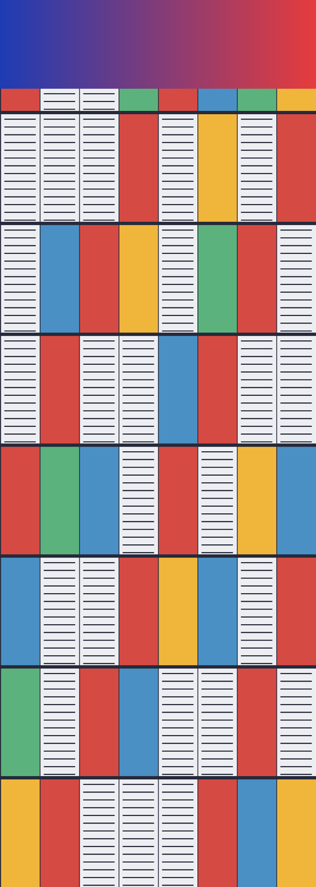
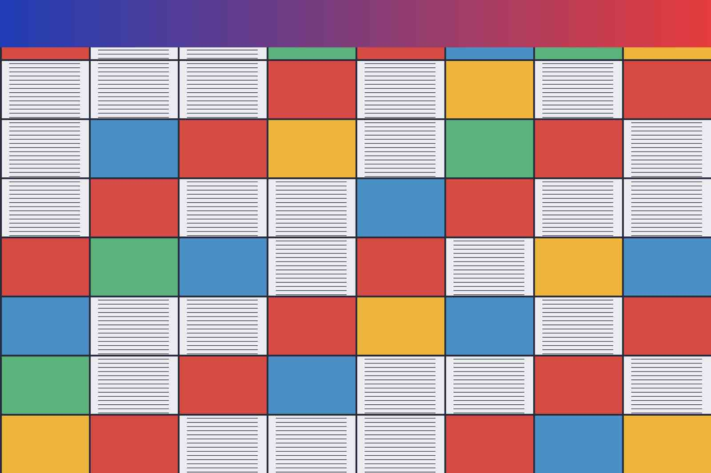

# Images — a visual check

Open this file in dreamd and look at it. Nothing here is asserted by a test:
`ui-check.mjs` proves the page *knows* the right things — that the guard handed
over an `asset:` URL, that `--img-w` was recorded, that `--zoom` moved — and
proves nothing at all about what WebKit put on the glass. This document is the
other half, and it is meant to be read with your eyes.

Every image below is generated, not photographic. They come from one 2400×1600
source painted by a script: flat panels, hard grid lines and thin rules, with a
smooth gradient across the top. That shape is deliberate — hard edges are what
JPEG rings around and what a careless downscale aliases, and the gradient band is
the one place banding would show. `sips` produced each variant from that source.

## What to look for

Work down the page at 100% first, then press `Cmd`/`Ctrl` `+` a few times and do
it again. Six things, in rough order of how easily they break:

1. **Every image below the "should render" heading appears.** A missing one is
   the asset-protocol scope failing, not a broken file.
2. **Nothing overflows the measure.** Wide images clamp to the content column;
   the page never scrolls sideways.
3. **Images grow with the prose when you zoom** and keep their aspect ratio.
   This is the one that regressed historically: an `` is the only thing in
   a rendered document sized in device pixels rather than `em`, so without
   `--img-w` it sits unchanged while the text around it grows.
4. **The small icon is not blown up.** A 32px image stays 32px at 100%.
5. **Clicking any image opens the viewer** — scroll or pinch to zoom, drag to
   pan, double-click to toggle fit ↔ 1:1, `Esc` to close. While it is open the
   zoom keys move the *image*, not the document behind it.
6. **The refused images at the bottom show alt text, not a broken-image icon,
   and never appear.** That is the containment guard doing its job.

---

## Sizes

### Tiny — 32×32 PNG

Should sit at its natural size, unscaled, on the line with the text around it.

### Ordinary figure — 640×427 PNG

The common case: narrower than the measure, so it draws at its own size and the
grid stays crisp.

### Oversize — 2400×1600 PNG

Wider than any sane measure, so it must clamp to the content column. At 100% the
thin rules inside the pale cells will alias; that is the downscale, not a bug.

### Tall — 500×1400 PNG

Taller than the window. It should clamp on *width* only and be scrolled past,
never squashed to fit the viewport height.

### Very wide — 1800×300 JPEG

The opposite aspect. Watch that it clamps to the measure without the page
gaining a horizontal scrollbar.

---

## Qualities

The same 1600×1067 pixels, saved twice. Zoom in on the hard edges where the grid
lines meet the pale cells: at quality 15 they carry visible ringing and blocking
that quality 90 does not. If the two look identical, something is serving one
file for both.

### JPEG, quality 90

### JPEG, quality 15

---

## Shapes markdown can make

An image with a title attribute, which becomes a tooltip on hover:

An image inline in a sentence —  — which is
also the case that matters for highlighting, since the image is a node inside a
paragraph you can select across. Try highlighting this whole sentence.

A linked image, which is an `<a>` wrapping an ``; clicking it should open
the *viewer*, not the browser, because the image intercept runs after the link
one:

A `data:` URI, left alone by the guard because it resolves nothing:

---

## Should *not* render

These four are the negative half, and the point is that they fail quietly. Each
should show its alt text and nothing else — no broken-image icon, no network
request, no file opened.

A relative path climbing out of the repo root:

A file that does not exist, but would be allowed if it did:

An absolute filesystem path, which the intercept deliberately leaves alone
rather than converting — so it resolves against the webview origin and fails:

A remote image. Permitted by the CSP's `img-src`, so this one *may* draw if you
have a network; what matters is that it is never rewritten to `asset:`:

